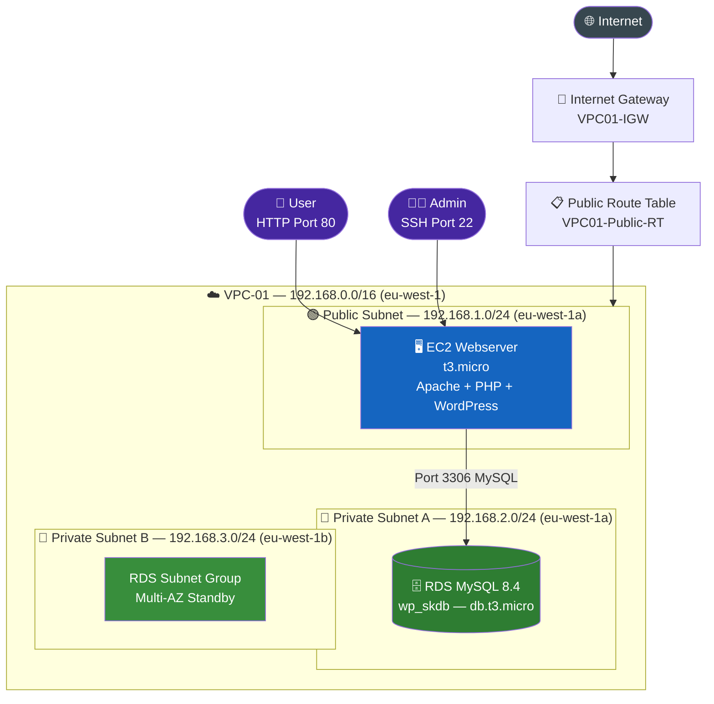
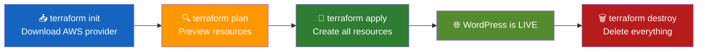

# 🏗️ Terraform Project — WordPress on AWS (Infrastructure as Code)

> Provision a complete AWS infrastructure and deploy WordPress automatically using Terraform  
> **Cloud DevOps Project — SURESHKUMAR S**

---

## 📌 What This Project Does

This project uses **Terraform** to automatically create the entire AWS infrastructure needed to run a **WordPress website** — from scratch, with a single command.

**What gets created on AWS (eu-west-1 region):**

| Resource | Details |
|---|---|
| VPC | `192.168.0.0/16` |
| Internet Gateway | Attached to VPC |
| Public Subnet | `192.168.1.0/24` — Webserver lives here |
| Private Subnet A | `192.168.2.0/24` — RDS (eu-west-1a) |
| Private Subnet B | `192.168.3.0/24` — RDS (eu-west-1b) |
| Route Table | Public subnet → Internet Gateway |
| Security Group (EC2) | SSH (22) + HTTP (80) open |
| Security Group (RDS) | MySQL (3306) — only from webserver subnet |
| EC2 Instance | t3.micro — Webserver (Apache + PHP + WordPress) |
| RDS Instance | MySQL 8.4.8, db.t3.micro — WordPress Database |

No manual clicking on AWS Console — **Terraform handles everything!**

---

## 🏗️ Architecture



---

## 📁 Project Structure

```
Terraform-Project/               ← GitHub Repo Root
├── provider.tf                   ← AWS provider config (region: eu-west-1)
├── vpc.tf                        ← VPC + Internet Gateway
├── subnet.tf                     ← Public subnet + 2 Private subnets
├── subnet_grp.tf                 ← RDS DB Subnet Group (uses private subnets)
├── route_table.tf                ← Public Route Table + association
├── security_grp.tf               ← Security groups for EC2 and RDS
├── webserver.tf                  ← EC2 instance (runs wordpress.sh on launch)
├── rds.tf                        ← RDS MySQL instance
├── wordpress.sh                  ← Bootstrap script (auto-installs WordPress)
└── .gitignore                    ← Ignores .terraform/, *.tfstate, *.pem
```

🔗 GitHub Repo: [github.com/skccna1998/Terraform-Project](https://github.com/skccna1998/Terraform-Project)

---

## 🛠️ Tech Stack

| Layer | Technology |
|---|---|
| IaC Tool | Terraform (AWS Provider ~> 6.0) |
| Cloud Provider | AWS (eu-west-1 — Ireland) |
| Web Server | Apache HTTP Server |
| App Layer | PHP + php-mysqlnd |
| CMS | WordPress (latest) |
| Database | MySQL 8.4.8 on Amazon RDS |
| EC2 OS | Amazon Linux 2023 (dnf package manager) |
| EC2 Type | t3.micro |
| RDS Type | db.t3.micro |

---

## ✅ Prerequisites

### AWS Account Setup

- [ ] AWS Account with IAM user
- [ ] IAM user must have permissions for: EC2, RDS, VPC, Subnets, Security Groups
- [ ] AWS CLI installed and configured (`aws configure`)
- [ ] An EC2 Key Pair named **`webserver_key`** already created in `eu-west-1`

### Terraform Installed on your machine

See the Windows installation guide below 👇

---

## 🪟 Install Terraform on Windows

### Step 1 — Download Terraform

1. Visit the official Terraform download page:
   ```
   https://developer.hashicorp.com/terraform/install#windows
   ```
2. Select **Windows** → choose **`amd64`** (works for most machines)
3. Click **Download** — saves a `.zip` file

### Step 2 — Extract the Files

1. Locate the downloaded `.zip` file (usually in `Downloads/`)
2. Right-click → **Extract All** (or use WinRAR / 7-Zip)
3. You'll find a single file: `terraform.exe`
4. Create a folder `C:\terraform\` and move `terraform.exe` there

### Step 3 — Add Terraform to System PATH

This lets you run `terraform` from any terminal:

1. Press `Windows Key` → search **"Environment Variables"**
2. Click **"Edit the system environment variables"**
3. Click the **"Environment Variables"** button
4. Under **System Variables**, find **Path** → click **Edit**
5. Click **New** → type `C:\terraform`
6. Click **OK** on all windows to save

### Step 4 — Verify Installation

Open **Command Prompt** or **PowerShell** and run:

```bash
terraform version
```

Expected output:
```
Terraform v1.x.x
on windows_amd64
```

✅ Terraform is installed and ready!

### Step 5 — (Optional) Install via Chocolatey

If you have the Chocolatey package manager, run just one command:

```bash
choco install terraform
```

This installs Terraform and adds it to PATH automatically — no manual steps needed.

---

## 🚀 How to Deploy

### Step 1 — Clone the Repository

```bash
git clone https://github.com/skccna1998/Terraform-Project.git
cd Terraform-Project
```

### Step 2 — Configure AWS Credentials

```bash
aws configure
```

Enter your details:
```
AWS Access Key ID:     <your-access-key>
AWS Secret Access Key: <your-secret-key>
Default region name:   eu-west-1
Default output format: json
```

> 🔐 Never commit your AWS credentials to GitHub. The `.gitignore` already excludes sensitive files.

### Step 3 — Initialize Terraform

Downloads the AWS provider plugin:

```bash
terraform init
```

Output:
```
Terraform has been successfully initialized!
```

### Step 4 — Preview What Will Be Created

```bash
terraform plan
```

This shows you **exactly what resources** Terraform will create — nothing is built yet. Review it before applying.

### Step 5 — Deploy the Infrastructure

```bash
terraform apply
```

Type `yes` when prompted. Terraform will now create all the AWS resources in order.

⏱️ **Expected time:** 5–8 minutes (RDS takes the longest)

### Step 6 — Access WordPress

Once `terraform apply` finishes, get the EC2 public IP from:
- The **Outputs** section in the terminal, or
- AWS Console → EC2 → Your instance → Public IPv4

Open in browser:
```
http://<EC2-Public-IP>/
```

You'll see the **WordPress setup wizard** — complete it and your site is live! 🎉

### Step 7 — Destroy Everything (Clean Up)

When you're done, delete all AWS resources to avoid charges:

```bash
terraform destroy
```

Type `yes` when prompted. Every resource Terraform created will be deleted.

---

## 🔁 Terraform Command Flow



---

## ⚙️ What Each Terraform File Does

### `provider.tf` — Cloud Provider Setup

Tells Terraform to use AWS and deploy everything to **eu-west-1 (Ireland)** region.

### `vpc.tf` — Network Foundation

Creates:
- **VPC-01** with IP range `192.168.0.0/16`
- **Internet Gateway (VPC01-IGW)** — gives the VPC access to the internet

### `subnet.tf` — Subnets (3 total)

| Subnet | CIDR | Zone | Type | Purpose |
|---|---|---|---|---|
| VPC01-Public-SN | `192.168.1.0/24` | eu-west-1a | Public | EC2 Webserver |
| VPC01-Private-SN01 | `192.168.2.0/24` | eu-west-1a | Private | RDS primary |
| VPC01-Private-SN02 | `192.168.3.0/24` | eu-west-1b | Private | RDS subnet group |

> Public subnet auto-assigns a public IP to instances launched inside it.

### `subnet_grp.tf` — RDS Subnet Group

Groups the two private subnets as a **DB Subnet Group** — AWS requires at least 2 AZs for RDS subnet groups.

### `route_table.tf` — Internet Routing

Creates a public route table: all traffic (`0.0.0.0/0`) routes through the Internet Gateway. Associates it with the public subnet.

### `security_grp.tf` — Firewall Rules

**Webserver Security Group (`webserver_nsg`):**

| Direction | Port | Source | Purpose |
|---|---|---|---|
| Inbound | `22` | `0.0.0.0/0` | SSH access |
| Inbound | `80` | `0.0.0.0/0` | HTTP web access |
| Outbound | All | `0.0.0.0/0` | All traffic allowed |

**RDS Security Group (`rds_nsg`):**

| Direction | Port | Source | Purpose |
|---|---|---|---|
| Inbound | `3306` | `192.168.1.0/24` | MySQL — webserver only |
| Outbound | All | `0.0.0.0/0` | All traffic allowed |

> 🔐 RDS is only accessible from the EC2 webserver — not from the internet.

### `webserver.tf` — EC2 Instance

| Config | Value |
|---|---|
| AMI | `ami-03a25ed280b358f5b` (Amazon Linux 2023) |
| Instance Type | `t3.micro` |
| Key Pair | `webserver_key` |
| Disk | 10 GB gp3 |
| Subnet | Public Subnet |
| User Data | Runs `wordpress.sh` automatically on first boot |

### `rds.tf` — MySQL Database

| Config | Value |
|---|---|
| Engine | MySQL 8.4.8 |
| Instance Type | `db.t3.micro` |
| Storage | 20 GB |
| DB Name | `wp_skdb` |
| Username | `wp_suresh` |
| Subnet Group | Private subnets only (no public access) |

### `wordpress.sh` — Auto WordPress Installer

This script runs **automatically on EC2 first boot** (via `user_data`) and sets up WordPress end-to-end:

```
1. Updates packages          → dnf update -y
2. Installs stack            → Apache + PHP + php-mysqlnd
3. Starts Apache             → systemctl start httpd
4. Downloads WordPress       → wget latest.tar.gz
5. Installs WordPress        → /var/www/html/
6. Sets permissions          → chown apache, chmod 755
7. Configures wp-config.php  → DB name, user, password
8. Injects RDS endpoint      → sed replaces 'localhost' with RDS address
9. Restarts Apache           → systemctl restart httpd
```

> 💡 The RDS endpoint is **injected automatically** by Terraform using `templatefile()` — you don't need to edit anything manually.

---

## 🐞 Troubleshooting

| Problem | Cause | Fix |
|---|---|---|
| `Error: No valid credential sources` | AWS not configured | Run `aws configure` |
| `InvalidKeyPair.NotFound: webserver_key` | Key pair missing in eu-west-1 | Create a key pair named `webserver_key` in AWS Console → EC2 → Key Pairs |
| RDS creation times out | RDS takes 5–7 mins to provision | Wait and re-run `terraform apply` |
| WordPress page not loading after deploy | `wordpress.sh` still running on EC2 | Wait 2–3 minutes after EC2 starts, then refresh browser |
| `Error: AMI not found` | AMI ID is region-specific | This project uses `eu-west-1` — update the AMI ID in `webserver.tf` if using a different region |
| Port 80 not accessible | Security Group issue | Check that `webserver_nsg` has port 80 inbound rule |

---

## 🔐 Security Notes

- RDS is placed in **private subnets** — no public IP, not reachable from the internet
- MySQL port `3306` is only open to `192.168.1.0/24` (webserver's subnet)
- AWS credentials are never stored in code — always use `aws configure` or IAM roles
- `.gitignore` excludes `*.tfstate`, `.terraform/`, `*.pem`, and `terraform.tfvars`
- For production: use **AWS Secrets Manager** to store DB passwords instead of hardcoding them

---

## ✅ What We Built

| Resource | Done |
|---|---|
| VPC + Internet Gateway | ✅ |
| Public + Private Subnets (3 total) | ✅ |
| Route Table + Association | ✅ |
| EC2 Security Group (SSH + HTTP) | ✅ |
| RDS Security Group (MySQL — internal only) | ✅ |
| EC2 Webserver (Apache + PHP) | ✅ |
| RDS MySQL 8.4 Database | ✅ |
| WordPress auto-installed via user_data | ✅ |
| RDS endpoint injected dynamically | ✅ |
| Full teardown with one command | ✅ |

---

## 👤 Author

**Sureshkumar S**  
Cloud DevOps Engineer | DevOps Enthusiast  
🔗 [github.com/skccna1998](https://github.com/skccna1998)
